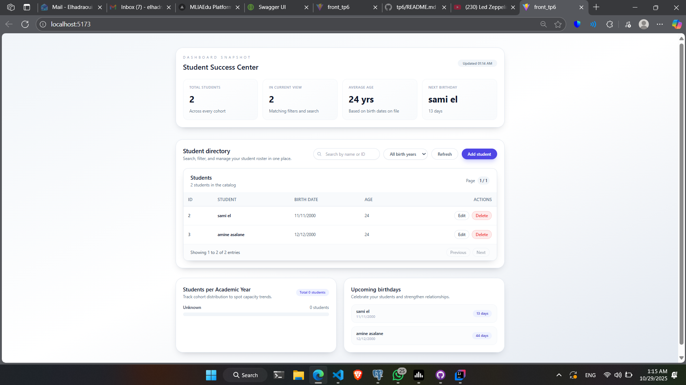

# Application de gestion des étudiants

Tableau de bord React + Vite + Tailwind pour gérer des étudiants, visualiser des statistiques et les répartitions par année.

## Captures d’écran

Placez vos images dans `docs/screenshots/` (ou `public/screens/`) puis référencez-les ci-dessous.

- Accueil  
  

- Tableau des étudiants  
  

- Formulaire d’ajout / édition  
  

- Statistiques et répartition par année  
  

Astuce:
- Si vous mettez les fichiers dans `public/screens/`, vous pouvez les référencer comme `/screens/accueil.png`.
- Exemple d’inclusion: ``

## Démarrage rapide

```sh
# Installer les dépendances
npm install

# Lancer le serveur de développement
npm run dev

# Construire pour la prod
npm run build

# Prévisualiser le build
npm run preview
```

Fichiers de config:
- Vite: [vite.config.js](vite.config.js)
- Tailwind: [tailwind.config.js](tailwind.config.js), [postcss.config.js](postcss.config.js)
- Entrée HTML: [index.html](index.html)
- CSS: [src/index.css](src/index.css)
- Entrée JS: [src/main.jsx](src/main.jsx)
- Scripts: [package.json](package.json)

## Structure du projet

```
.gitignore
eslint.config.js
index.html
package.json
postcss.config.js
README.md
tailwind.config.js
vite.config.js
public/
src/
  App.jsx
  index.css
  main.jsx
  assets/
  components/
    Notification.jsx
    StatsGrid.jsx
    StudentForm.jsx
    StudentTable.jsx
    YearDistribution.jsx
  services/
    studentApi.js
```

Composants principaux:
- App: [src/App.jsx](src/App.jsx)
- Formulaire étudiant: [src/components/StudentForm.jsx](src/components/StudentForm.jsx)
- Tableau des étudiants: [src/components/StudentTable.jsx](src/components/StudentTable.jsx)
- Statistiques: [src/components/StatsGrid.jsx](src/components/StatsGrid.jsx)
- Répartition par année: [src/components/YearDistribution.jsx](src/components/YearDistribution.jsx)
- Notifications: [src/components/Notification.jsx](src/components/Notification.jsx)

API et services:
- Service étudiants: [src/services/studentApi.js](src/services/studentApi.js)

